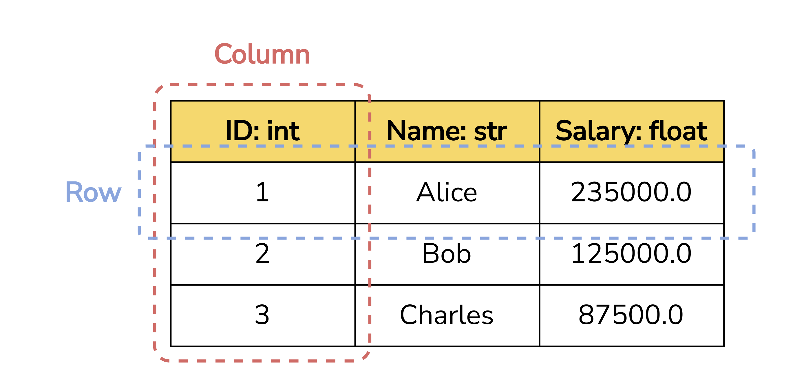

# Solo Project #1 - Durable `sunbears`


In this project, you are going to write a Python library for manipulating a table-like data structure, `sunbears`.

> 🐥 This project can be larger than you have imagined. Please start early!

> 🐥 If you get stuck, feel free to reach out to our teaching assistants.

## Getting Started

First, you use this template to create your **private** GitHub repository.

> 🐥 Your repository must be **private**. Otherwise, you are committing **plagiarism** implicitly.

## Core Abstraction: DataFrame

The core abstraction in this library is DataFrame, which is a class that represents a table structure.

<p align="center">
    
</p>

Tables we are interested have two main components:

- **Header** is a list of column names and their types
- **Data** is a list of rows whose values must comply with their column type

DataFrame is currently implemented as a class in Python. The class has the following initial attributes:

- `column_names: list[str]` represents a list of column names
- `column_types: list[type]` represents a list of column types (i.e., the type `column_name[i]` is `column_types[i]`)
- `rows: list[object]` represents a list of rows

> 🐥 Be sure to understand this constructor method before you proceed.

## Class Specification

DataFrame has the following methods:

### Method 1 - `insert`

`insert` is a function that appends a new `row` to the DataFrame object.

You need to ensure that the inserting `row` exists and must have the same number of elements as the number of columns. If the row does not satisfy the condition, raise `ValueError`.

Also, types of values in the `row` must match the column types. If the `row` does not satisfy this condition, raise `TypeError`.

To raise either `ValueError` or `TypeError`, you may use the following code:

```python
raise ValueError("[error message]")
```

### Method 2 - `remove`

`remove` is a function that removes a row at index `index` from the DataFrame object. However, you do not need to physically remove the row, as it will be troublesome. We instead suggest you to just mark the row as removed. This means that you need to ensure that all methods must treat this row as removed.

There are multiple methods to mark a row as removed. Feel free to experiment it by yourself and do not forget that you may need to defend your rational in the check-out session.

> 🐥 You must not physically remove the row.

### Method 3 - `__str__`

`__str__` is a private function that creates a string representation of the DataFrame object.

We provide you with an initial implementation of this function. You may want to try it by using the following code:

```python
print(df)
```

where `df` is a DataFrame object.

You need to make sure that the removed rows are not displayed in the string representation.

### Method 4 - `persist_to_disk`

`persist_to_disk` is a function that serializes the DataFrame object and write the serialization as a file, namely `file_path`.

To serialize, you need to design a file format, where you can easily cast your DataFrame object into it and *vice versa*. At least, your file format must contain all the information (e.g., `column_names`, `column_types`, `rows`) in the DataFrame so that you can reconstruct a DataFrame object from the file. You may want to explore existing file formats: CSV, TSV, JSON, XML, etc.

You need to describe your file format design in the code including your rationale.

More importantly, you need to ensure that the directory containing the `file_path` exists. Otherwise, raise `FileNotFoundError`.

> 🐥 You do not need to include your removed rows in the file.

### Method 5 - `load_from_disk`

`load_from_disk` is a function that reads a file at `file_path` and uses its content to reconstruct a DataFrame object.

You also need to ensure that the directory containing the `file_path` exists. Otherwise, raise `FileNotFoundError`.

More importantly, this function must be able to load only a file generated by the `persist_to_disk` method.

> 🐥 You may want to put a signature string into the file (e.g., the first line of the file) so that you can easily identify whether the file is generated using the `persist_to_disk` method.
<!-- 
### Method 6 - `project`

`project` is a function that creates a new DataFrame object by selecting specific columns from this DataFrame object based on `projected_columns`.

> 🐥 It is possible that columns in `projected_columns` are duplicated. You just need to duplicate columns in the new DataFrame object.

> 🐥 You might want to start from choosing the columns you want to copy, and get the values from the original rows for those columns, and add to your customized new clone Dataframe.

You need to ensure that columns in `projected_columns` must exist in `column_names`. Otherwise, raise `KeyError`.

### Method 7 - `select`

> 🐥 This is the hardest function. You do not need to get it 100% if you do not have time to understand.

`select` is a function that creates a new DataFrame object by retrieving rows from this DataFrame object that satisfy all predicates in `predicates`.

#### Dealing with one predicate

Those predicates must be objects of class `Filter`. `Filter` objects represent the following expression:

```
[lvalue]:[ltype] [op] [rvalue]:[rtype]
```

For example, predicate `Filter("salary", ValueType.IDENTIFIER, 100000.0, ValueType.CONSTANT, FilterOp.GREATER_THAN_OR_EQUAL)` ensures the following condition:

```
salary:IDENTIFIER >= 100000.0:CONSTANT
```

or mathematically,

$$
salary >= 100000
$$

`lvalue` and `rvalue` (`value`) can be either `ValueType.IDENTIFIER` or `ValueType.CONSTANT`. `ValueType.IDENTIFIER` means that `value` must be a column name. If the `value` is not the column name, raise `KeyError`. `ValueType.CONSTANT` means that `value` must be a literal (either `int`, `float`, and `str`).

`op` is a `FilterOp` object representing one of the six possible operators: `=`, `!=`, `<`, `<=`, `>`, and `>=`.

More importantly, there are three possible cases for predicates:

- Both `lvalue` and `rvalue` are `ValueType.IDENTIFIER`. You must ensure that both `lvalue` and `rvalue` represent columns whose types are the same.

- Either `lvalue` or `rvalue` is `ValueType.IDENTIFIER`. This means the other `value` is `ValueType.CONSTANT`. You must ensure that `value` that is `ValueType.CONSTANT` must have the same type as the column from the `value` that is `ValueType.IDENTIFIER`.

- Both `lvalue` and `rvalue` are `ValueType.CONSTANT`. You must ensure that both `lvalue` and `rvalue` are values of the same type.

If the condition does not satisfy, raise `TypeError`.

#### Dealing with multiple predicates

It is possible that there are multiple predicates in `predicates`. You need to ensure that retrieved rows must satisfy all predicates. -->

## Local Testing

> 🐥 You must not test your code using BigGrade. Use our local testing script. 

You can check whether your implementation is correct by running our test suite. We implement the suite using `pytest`. You can easily run it by installing `pytest` module on your machine as follows:

```
pip install -U pytest
```

Check that you installed correctly:

```
pytest --version
```

Make sure that you are in the outermost directory and use the following command:

```
pytest
```

If you run correctly, you should see something like this:

```
...
FAILED src/tests/unit/test_select.py::test_both_constant_false - AttributeError: 'NoneType' object has no attribute 'rows'
FAILED src/tests/unit/test_select.py::test_type_error_both_identifier - Failed: DID NOT RAISE <class 'TypeError'>
FAILED src/tests/unit/test_select.py::test_type_error_one_identifier - Failed: DID NOT RAISE <class 'TypeError'>
FAILED src/tests/unit/test_select.py::test_type_error_both_constant_float_int - Failed: DID NOT RAISE <class 'TypeError'>
FAILED src/tests/unit/test_select.py::test_type_error_both_constant_int_str - Failed: DID NOT RAISE <class 'TypeError'>
FAILED src/tests/unit/test_select.py::test_multiple_predicates - AttributeError: 'NoneType' object has no attribute 'rows'
======================================================= 36 failed, 8 passed in 0.18s ========================================================
```

Note that this depends on how correct your implementation is.

## Submission

Download your repository as a ZIP file. Go to [BigGrade](https://biggrade.pnx.guide) and upload the ZIP file onto the assignment. Your submission will be autograded. Note that BigGrade only grades the correctness (not the code quality and your understanding).

## Grading Rubric

There are three phases on grading your assignment: Correctness, Code Quality, and Code Understanding.

### Correctness (70%)

Your implementation must pass all of our test cases. You may receive partial scores if your implementation can pass some cases.

Our test cases are broken down into three levels, as follows.

#### Unit Test (20%)

Those test cases exercise whether each method is working correctly or not. Methods under test are: `__str__` and `insert`. In order to gain points, you need to pass all the tests for each method.

#### Integration Test (30%)

Those test cases exercise scenarios where multiple methods are working together. Methods under test are: `__str__`, `export`, `import`, `insert`, and `remove`. In order to gain points, you need to pass all the tests for each test suite.

#### End-to-End Test (20%)

Those test cases mimic real-world workloads to test the robustness of your implementation. Methods under test are: `__str__`, `export`, `import`, `insert`, `remove`, `project`, and `select`. In order to gain points, you need to pass all the tests for each test suite.

### Code Quality (30%)

All code must be well-documented and clean. You should consult with [PEP 8](https://peps.python.org/pep-0008/).

> 🐥 You do not need to apply all suggestions in [PEP 8](https://peps.python.org/pep-0008/). We are less strict than this.

### Code Understanding

Once you have submitted the code and received scores that you satisfy, you may reserve a check-out slot with us. During the check-out, you will be asked several questions to check your understanding. There are three possible results for the check-out:

- **Good (1.0x)** means you can answer all the required questions.
- **Pass (0.5x)** means you can answer some of the required questions.
- **Fail (0.0x)** means you can answer only a few or none of the required questions.

If you receive **Fail**, you may ask to do another check-out or submit a video recording of you answering the missed questions. Note that you can get at most **Pass (0.5x)** if you are in this circumstance.
